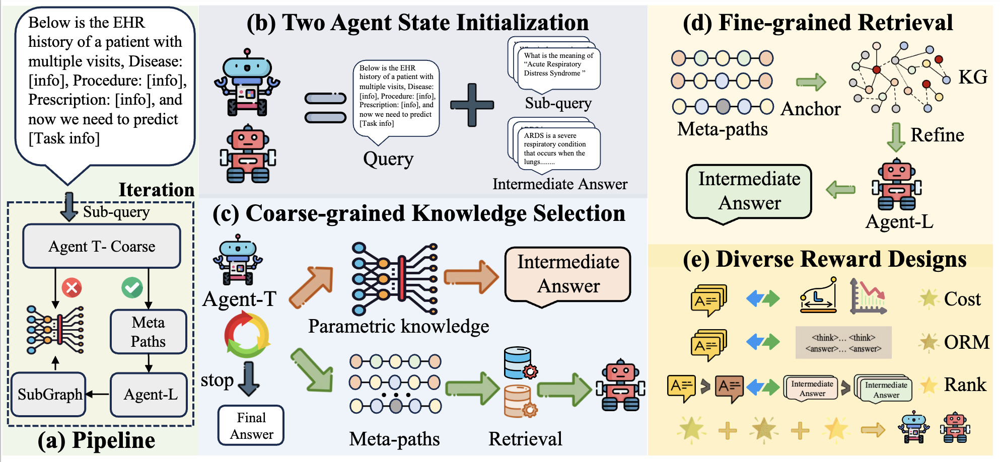

<h1 align="center"> Grounded by Experience: Generative Healthcare Prediction Augmented with Hierarchical Agentic Retrieval </h1>


## About Our Work

Update: 2025/10/13: We have created a repository for the paper titled *Grounded by Experience: Generative Healthcare Prediction Augmented with Hierarchical Agentic Retrieval*, which has been submitted to the ==*TKDE 2025*==. In this repository, we offer the preprocessing scripts and algorithm files to showcase the reproducibility of our work.




## Requirements

- langchain==0.3.6
- torch==2.4.0+cu124
- dgl==1.1.2
- faiss==1.8.0
- llamafactory==0.9.2.dev0

## Data Sets

Owing to the copyright stipulations associated with the dataset, we are unable to provide direct upload access. However, it can be readily obtained by downloading directly from the official website: [MIMIC-III](https://physionet.org/content/mimiciii/1.4/), [MIMIC-IV](https://physionet.org/content/mimic-iv/2.2/),[eICU](https://eicu-crd.mit.edu/). 

The structure of the data set should be like,

```powershell
data
|_ REA
|  |_ MIII
|  |_ _processed
|  |_ _ _datasets_pre_stand.pkl (Please read the README to get the data.)
|  |_ MIV-Note
|  |_ _ _datasets_pre_stand.pkl
|_ LOS
|_ _MIII
|  |_ _processed
|  |_ _ _datasets_pre_stand.pkl
|  |_ _ rare_patient.pkl
```

## RUN

```powershell
# stage 1: warm-up sampling
## change main.py, uncomment the following lines in run_single_config
create_sft_data_flask(train_dataloader, root_to + 'train_sft_data.jsonl', config, map_dict, task_mode=task_mode, train_mode=True)
create_sft_data(val_dataloader, root_to + 'val_sft_data.pkl', config, map_dict, task_mode=task_mode, train_mode=False)
create_sft_data_flask(test_dataloader, root_to + 'test_sft_data.jsonl', config, map_dict, task_mode=task_mode, train_mode=False) 
train=True
## change config.py, change LLM_PATH, T_LLM_PATH, MODEL_PATH
LLM_PATH=T_LLM_PATH=MODEL_PATH="/hpc2hdd/home/sguo349/czhaobo/huggingface/hub/qwen25-7B"

sbatch raghealth-main.slurm

# stage 2: SFT tuning, please make sure you have the ours_lora_sft_custom.yaml, e.g., examples/train_lora/ours/REA/MIV/ours_lora_sft_custom.yaml and set the dir in the dataset_info.jsonl
sbatch raghealth-sft.slurm

# stage 3: RL tuning,  please make sure you have the ours_lora_sft_custom.yaml, e.g., examples/train_lora/ours/REA/MIV/ours_lora_sft_custom.yaml
sbatch raghealth-ppo.slurm

# stage 4: inference
## change main.py
train=False
## change config.py, change LLM_PATH, T_LLM_PATH, MODEL_PATH 
LLM_PATH=T_LLM_PATH=MODEL_PATH="/hpc2hdd/home/sguo349/czhaobo/RAGHealth/LLaMA-Factory/output/LOS/MIV/ours_lora_sft"
sbatch raghealth-main.slurm
```

## Paper Link & Bib

We will update after acceptance.

## Acknowledge & Contact

You could contact czhaobo@connect.ust.hk if you have any problems. If you want to make several collaboration in the healthcare fields, please do not hesitate to send an email to him.

